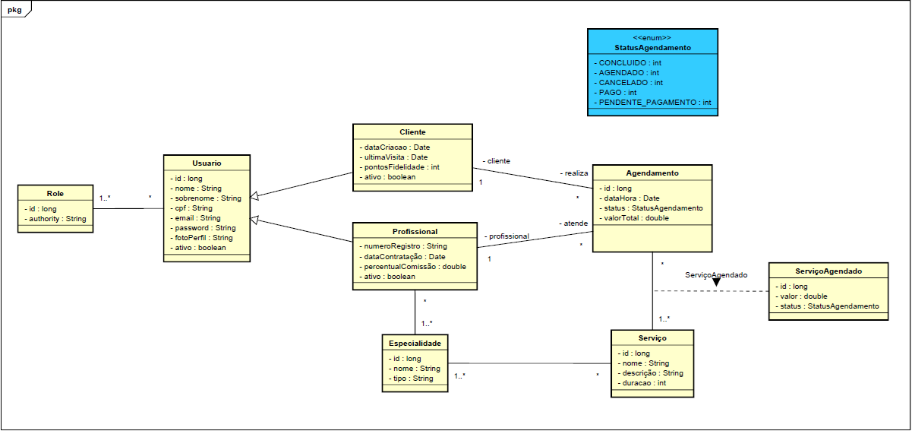

# Grupo 5 - Sistema de Agendamento para salão de beleza

## 1. Introdução

### 1.1 Justificativa

Atualmente, muitos estabelecimentos de pequeno e médio porte ainda dependem de métodos manuais para a gestão de suas operações, como agendas de papel, planilhas eletrônicas ou aplicativos de mensagens (WhatsApp). Tais métodos, embora funcionais até certo ponto, são ineficientes, suscetíveis a erros humanos e não fornecem dados estratégicos para o crescimento do negócio.

A implementação de um sistema de gestão centralizado e digital justifica-se pela necessidade de otimizar processos, reduzir falhas operacionais (como agendamentos duplicados ou esquecidos), melhorar a comunicação com o cliente e fornecer uma base sólida para a tomada de decisões gerenciais.

### 1.2 Descrição do problema

A gestão manual ou descentralizada de um estabelecimento de beleza acarreta uma série de problemas práticos que impactam diretamente a produtividade e a lucratividade:

- Falta de Centralização: A agenda do estabelecimento fica dispersa entre diferentes profissionais ou em suportes físicos, dificultando a visualização da disponibilidade geral.

- Controle de Agendamentos Ineficiente: O processo de marcar, cancelar ou reagendar horários é manual, demorado e propenso a falhas, gerando conflitos de horário e insatisfação do cliente.

- Gestão Financeira Rudimentar: O cálculo de comissões para profissionais, o controle de pagamentos e o fluxo de caixa são feitos de forma manual, aumentando o risco de erros e a dificuldade em obter uma visão financeira clara.

- Relacionamento com o Cliente Limitado: Não há um registro do histórico de serviços de cada cliente, o que impede a personalização do atendimento e a criação de programas de fidelidade eficazes.

- Ausência de Métricas e Relatórios: É praticamente impossível extrair dados importantes, como os serviços mais rentáveis, os profissionais mais requisitados ou os períodos de maior movimento, informações cruciais para o planejamento estratégico.

### 1.3 Motivação

A motivação central deste projeto é de natureza técnica e acadêmica, com um foco aprofundado na exploração prática de estratégias de persistência de dados em sistemas de software modernos. Embora a construção de uma aplicação web completa seja um objetivo, o pilar do trabalho é utilizar este cenário prático (sistema de gestão para estabelecimentos de beleza) como um laboratório para investigar e implementar uma arquitetura de persistência poliglota.

O projeto se propõe a ir além do modelo tradicional de um único banco de dados relacional, abordando o desafio de como diferentes tipos de dados, com seus respectivos requisitos de consistência, performance e estrutura, demandam soluções de armazenamento distintas.

## 2. Plano

### 2.1 Objetivos Geral

Projetar, implementar e analisar um sistema web funcional para gestão de estabelecimentos de beleza, utilizando-o como um estudo de caso prático para a aplicação de uma arquitetura de persistência poliglota, na qual diferentes tecnologias de armazenamento de dados são integradas para resolver problemas específicos de performance, escalabilidade, flexibilidade e consistência.

### 2.2 Objetivos especificos

- **Otimizar a Agenda:**
  Substituir agendamentos manuais por uma agenda digital centralizada, eliminando conflitos de horário e otimizando a rotina da recepção.

- **Fortalecer o Relacionamento com o Cliente:**
  Criar um cadastro de clientes com histórico de serviços para permitir um atendimento personalizado e embasar futuras ações de fidelização.

- **Automatizar a Gestão de Profissionais:**
  Gerenciar perfis e horários dos profissionais, automatizando o cálculo de comissões para eliminar controles manuais e reduzir erros.

- **Fornecer Visão Gerencial:**
  Oferecer ao gestor uma visão clara do desempenho do negócio através de painéis com métricas essenciais, como faturamento e serviços mais populares.

- **Garantir a Segurança dos Dados:**
  Implementar um sistema de acesso seguro baseado em perfis (gestor, profissional), garantindo que cada usuário acesse apenas as informações pertinentes à sua função.

### Tecnologias e Ferramentas

- Java 21
- Spring Boot
- ORM: Postgresql
- ODM: Mongodb
- Integrador: Redis
- Javafx
- JUnit
- JavaDoc e Swagger

## 3. Modelagem

### 3.1 Diagrama de Classes:

