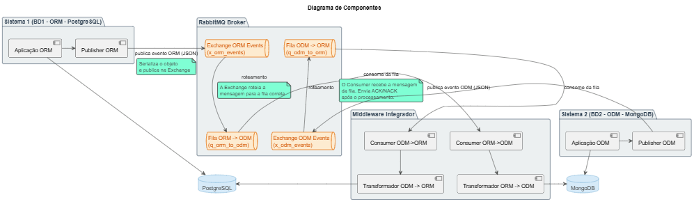
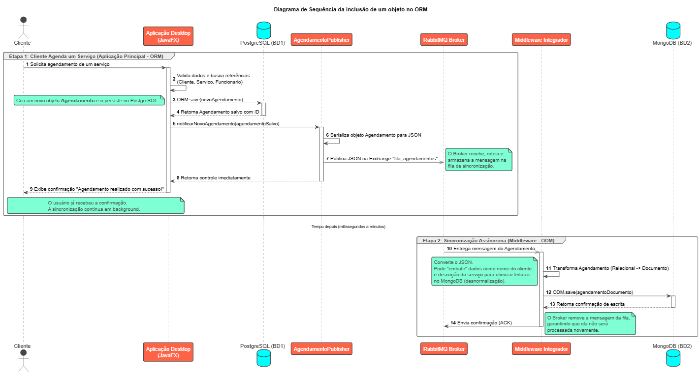
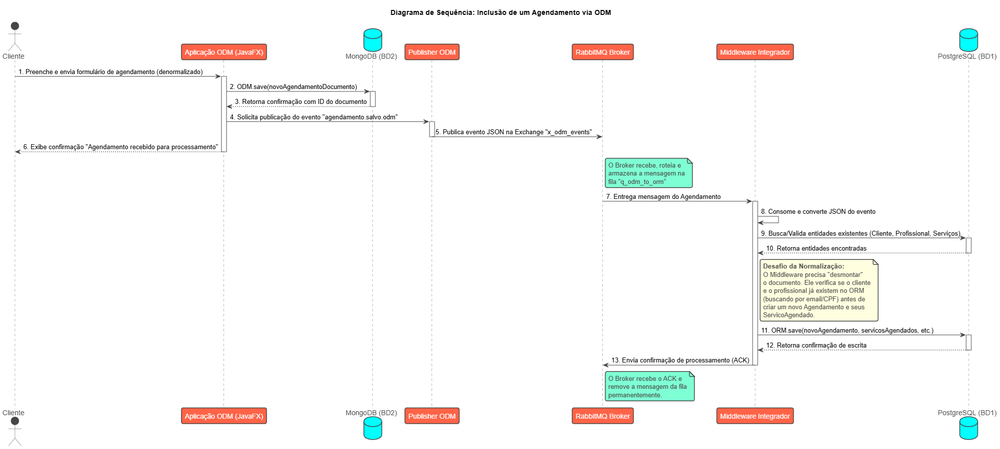

# Grupo 5 - Sistema de Agendamento para salão de beleza

## 1. Introdução

### 1.1 Justificativa

Atualmente, muitos estabelecimentos de pequeno e médio porte ainda dependem de métodos manuais para a gestão de suas operações, como agendas de papel, planilhas eletrônicas ou aplicativos de mensagens (WhatsApp). Tais métodos, embora funcionais até certo ponto, são ineficientes, suscetíveis a erros humanos e não fornecem dados estratégicos para o crescimento do negócio.

A implementação de um sistema de gestão centralizado e digital justifica-se pela necessidade de otimizar processos, reduzir falhas operacionais (como agendamentos duplicados ou esquecidos), melhorar a comunicação com o cliente e fornecer uma base sólida para a tomada de decisões gerenciais.

### 1.2 Descrição do problema

A gestão manual ou descentralizada de um estabelecimento de beleza acarreta uma série de problemas práticos que impactam diretamente a produtividade e a lucratividade:

- Falta de Centralização: A agenda do estabelecimento fica dispersa entre diferentes profissionais ou em suportes físicos, dificultando a visualização da disponibilidade geral.

- Controle de Agendamentos Ineficiente: O processo de marcar, cancelar ou reagendar horários é manual, demorado e propenso a falhas, gerando conflitos de horário e insatisfação do cliente.

- Gestão Financeira Rudimentar: O cálculo de comissões para profissionais, o controle de pagamentos e o fluxo de caixa são feitos de forma manual, aumentando o risco de erros e a dificuldade em obter uma visão financeira clara.

- Relacionamento com o Cliente Limitado: Não há um registro do histórico de serviços de cada cliente, o que impede a personalização do atendimento e a criação de programas de fidelidade eficazes.

- Ausência de Métricas e Relatórios: É praticamente impossível extrair dados importantes, como os serviços mais rentáveis, os profissionais mais requisitados ou os períodos de maior movimento, informações cruciais para o planejamento estratégico.

### 1.3 Motivação

A motivação central deste projeto é de natureza técnica e acadêmica, com um foco aprofundado na exploração prática de estratégias de persistência de dados em sistemas de software modernos. Embora a construção de uma aplicação web completa seja um objetivo, o pilar do trabalho é utilizar este cenário prático (sistema de gestão para estabelecimentos de beleza) como um laboratório para investigar e implementar uma arquitetura de persistência poliglota.

O projeto se propõe a ir além do modelo tradicional de um único banco de dados relacional, abordando o desafio de como diferentes tipos de dados, com seus respectivos requisitos de consistência, performance e estrutura, demandam soluções de armazenamento distintas.

## 2. Plano

### 2.1 Objetivos Geral

Projetar, implementar e analisar um sistema web funcional para gestão de estabelecimentos de beleza, utilizando-o como um estudo de caso prático para a aplicação de uma arquitetura de persistência poliglota, na qual diferentes tecnologias de armazenamento de dados são integradas para resolver problemas específicos de performance, escalabilidade, flexibilidade e consistência.

### 2.2 Objetivos especificos

- **Otimizar a Agenda:**
  Substituir agendamentos manuais por uma agenda digital centralizada, eliminando conflitos de horário e otimizando a rotina da recepção.

- **Fortalecer o Relacionamento com o Cliente:**
  Criar um cadastro de clientes com histórico de serviços para permitir um atendimento personalizado e embasar futuras ações de fidelização.

- **Automatizar a Gestão de Profissionais:**
  Gerenciar perfis e horários dos profissionais, automatizando o cálculo de comissões para eliminar controles manuais e reduzir erros.

- **Fornecer Visão Gerencial:**
  Oferecer ao gestor uma visão clara do desempenho do negócio através de painéis com métricas essenciais, como faturamento e serviços mais populares.

- **Garantir a Segurança dos Dados:**
  Implementar um sistema de acesso seguro baseado em perfis (gestor, profissional), garantindo que cada usuário acesse apenas as informações pertinentes à sua função.

### Tecnologias e Ferramentas

- Java 21
- Spring Boot
- Persistência usando Sring Data JPA
- Banco de dados ORM: Postgresql
- Banco de dados ODM: Mongodb
- Broker: RabbitMQ
- Javafx
- JUnit
- JavaDoc e Swagger

## 3. Cronograma

### Fase 1: Estrutura Principal (Concluída)

_Período: Sábado, 19/07 a Terça, 22/07_

- [x] Implementação da camada de persistência com **ORM (PostgreSQL)**.
- [x] Modelagem das entidades relacionais (`Agendamento`, `Cliente`, `Servico`, etc.).
- [x] Criação dos Repositórios com Spring Data JPA/Hibernate.
- [x] Definição da lógica de negócio inicial.

---

### Fase 2: Implementação e Finalização

| Data      | Foco Principal             | Tarefas Detalhadas                                                                                                                                                                                                              | Meta do Dia / Entregável                                              |
| :-------- | :------------------------- | :------------------------------------------------------------------------------------------------------------------------------------------------------------------------------------------------------------------------------ | :-------------------------------------------------------------------- |
| **23/07** | Estrutura ODM e Broker     | <ul><li>Definir esquemas para MongoDB.</li><li>Criar repositórios para MongoDB.</li><li>Instalar e configurar RabbitMQ.</li><li>Declarar Exchanges e Queues.</li></ul>                                                          | Base do MongoDB e RabbitMQ prontas e acessíveis.                      |
| **24/07** | Publisher e Listener       | <ul><li>Criar a classe `Publisher` na aplicação principal.</li><li>Estruturar o projeto do `Middleware Integrador`.</li><li>Implementar o `Consumer` básico para validar a comunicação.</li></ul>                               | Mensagem enviada pela app principal e recebida pelo Middleware.       |
| **25/07** | Middleware Integrador      | <ul><li>Implementar enriquecimento de dados (buscar no PostgreSQL).</li><li>Implementar transformação (desnormalização).</li><li>Salvar o documento final no MongoDB.</li><li>Implementar envio do `ACK` ao RabbitMQ.</li></ul> | Fluxo de sincronização de dados completo (end-to-end) funcional.      |
| **26/07** | Interface Gráfica (JavaFX) | <ul><li>Desenvolver telas principais (foco no agendamento).</li><li>Criar formulários, tabelas e botões.</li><li>Conectar ações da UI com a camada de serviço da aplicação ORM.</li></ul>                                       | UI funcional que permite criar/ler agendamentos, disparando o evento. |
| **27/07** | Testes e Documentação      | <ul><li>Escrever testes unitários para a lógica de transformação.</li><li>Iniciar a documentação com o SWAGGER.</li></ul>                                                                                                       | Qualidade do sistema garantida e documentação iniciada.               |
| **28/07** | Refinamento e Entrega      | <ul><li>Revisar e refatorar o código.</li><li>Corrigir bugs encontrados nos testes.</li><li>Finalizar a documentação com exemplos.</li><li>Preparar o projeto para entrega final.</li></ul>                                     | **Finalização do projeto**                                            |

## 4. Modelagem

### 4.1 Diagrama de Classes:

### 4.2 Diagrama de Componentes:

### 4.3 Diagrama de Sequência:

Inclusão de um objeto no ORM.

### 4.4 Diagrama de Sequência:

Inclusão de um objeto na ODM.

### 5. Instalação e Execução

Este guia descreve os passos necessários para configurar e executar o ecossistema completo do Booking Barber System localmente.

### Pré-requisitos

Antes de começar, garanta que você tenha os seguintes softwares instalados e em execução no seu ambiente:

- Java (JDK): Versão 17 ou superior.

- Maven: Para gerenciamento de dependências e build do projeto.

- PostgreSQL: Banco de dados relacional.

- MongoDB: Banco de dados de documentos.

- RabbitMQ: Broker de mensageria.

- Git: Para clonar o repositório.

### Configuração do Ambiente

**Clonar os Repositórios**
Clone os repositórios da Aplicação Principal e do Middleware Integrador para a sua máquina local.

### Configurar os Bancos de Dados

**PostgreSQL:**

- Crie um banco de dados para a aplicação principal (ex: `bookingbarber_orm_db`).

- Abra o arquivo `application.properties` da Aplicação Principal e ajuste as configurações de `spring.datasource` com a URL, seu usuário e senha.

**MongoDB:**

- Crie um banco de dados para a camada ODM (ex: `bookingsysodm`).

- Abra o `application.properties` da Aplicação Principal e do Middleware Integrador e ajuste a `spring.data.mongodb.uri` para apontar para o seu banco de dados.

### Povoar o Banco de Dados Relacional (Seed)

Para que a aplicação funcione com dados iniciais, é necessário popular o banco de dados ORM.

1. Conecte-se ao seu banco de dados PostgreSQL (`bookingbarber_orm_db`).

2. Execute o script SQL fornecido no projeto para inserir os dados iniciais (`Roles`, `Clientes`, `Profissionais`, `Serviços`) e sincronizar as sequências de ID.

### Executando o Ecossistema

A ordem de inicialização é importante para garantir que os componentes se conectem corretamente.

**Iniciar a Infraestrutura**
Garanta que os serviços do PostgreSQL, MongoDB e RabbitMQ estejam em execução.

- Dica: Para o RabbitMQ, verifique se o painel de gerenciamento está acessível em `http://localhost:15672` para monitorar as filas.

### Iniciar o Middleware Integrador

1. Abra o projeto sync-integrator na sua IDE.

2. Execute a classe principal (ex: `SyncIntegratorApplication.java`).

3. Verifique no console se ele se conectou com sucesso aos dois bancos de dados e ao RabbitMQ. Ele ficará "ouvindo" por novas mensagens.

### Iniciar a Aplicação Principal (ORM + JavaFX)

1. Abra o projeto da aplicação principal (`bookingbarber-sys`) na sua IDE.

2. Execute a classe principal (ex: `SysApplication.java`).

3. Aguarde o console mostrar que o Spring Boot iniciou. A janela de login da interface gráfica em JavaFX deverá aparecer automaticamente.

Neste ponto, todo o ecossistema está no ar. Você pode fazer o login com um dos usuários do script de seed e começar a testar os fluxos de agendamento.
